# Machine Learning for the Detection of Alzheimer's Disease

## Intro/Background

Alzheimer’s disease is the leading cause of dementia and the sixth-leading cause of death, affecting over 10 million people a year across the world. Symptoms may include memory loss, poor judgment, inability to recognize loved ones, and eventually death. Alzheimer’s primarily affects the elderly; as the population ages, Alzheimer’s becomes more and more widespread. At the moment, there is no cure for Alzheimer’s, making early detection of the disease imperative to delay the progress of the disease and improve the patient’s quality of living. Machine learning techniques have been heavily researched in assisting with early detection of Alzheimer’s through analysis of patient demographics and MRI and PET scans.

We will be using the Open Access Series of Imaging Studies (OASIS) [longitudinal dataset](https://www.kaggle.com/datasets/jboysen/mri-and-alzheimers/data?select=oasis_longitudinal.csv) and [images of the patients’ MRI scans](https://oasis-brains.org/#data). Features include demographic information including age, gender, education level, and socioeconomic status. Features also include survey and interview data, such as the Mini Mental State Examination score, administered by a health professional to assess cognitive impairment and the Clinical Dementia Rating, determined through a semi-structured interview testing different cognitive abilities. MRI imaging information including estimated total intracranial volume, normalized whole brain volume, and atlas scaling factor is also included.

## Problem Definition

A focus of current research is predicting the conversion of Mild Cognitive Impairment to AD using medical imaging. Early detection of Alzheimer’s Disease can allow patients more time to benefit from available treatments as well as giving patients and caregivers time to adjust to the subsequent changes. Classification of AD is a challenging task given the inherent large-size of MRI images which requires efficient feature extraction and classification for the improvement of current techniques. We hope to improve upon current classification models by incorporating  feature extraction methods.

## Methods

In order to evaluate the performance of existing classification techniques such as Support Vector Machines (SVM), Artificial Neural Networks (ANN), and Deep Learning, we first had to pre-process the selected dataset for model training. In this regard, given that the OASIS longitudinal dataset was chosen, we first dropped fields that are not of use to us and quantified non-numeric fields to perform Principal Component Analysis. Additionally, we created visualizations based on the primed dataset to explore specific trends. Specifically, this involved taking a closer look at the relationship between dementia rates and each feature:

* Gender
* Age
* EDUC: years of education
* SES: socioeconomic status
* MMSE: score on the Mini Mental State Examination
* CDR: clinical dementia rating
* eTIV: estimated total intracranial volume
* nWBV: normalized whole brain volume
* ASF: atlas scaling factor

At this point, we performed dimensionality reduction on the processed dataset using principal component analysis (PCA) to help remove potentially redundant features and to make the classification models computationally efficient. 

Once the dataset was pre-processed and PCA had been performed, we began the process of training the classification models using scikit-learn libraries. In that regard, we started with training the Artificial Neural Networks (ANN). For the purposes of training the ANN on the primed dataset, we used the rectified linear unit (ReLU) activation function and mean squared error (MSE) as the loss function. Once the model was trained, we also computed accuracy scores to serve as a comparison point between the different classification models.

Next, having completed the training of the ANN model, we chose to train the support vector machine (SVM) classification model. For this, we compared the observed performance of different support vector classification (SVC) kernels including:

* Linear
* Polynomial
* Radial Basis Function
* Sigmoid

Additionally, we observed the effect of making adjustments to the regularization parameter (corresponding to a hard or soft margin of classification) and gamma attributes. We tested regularization and gamma values with a gradual step-wise increment of 0.01 between 0.1 (inclusive) and 2. We also trained support vector machines with different numbers of principal components and kernels. This included using 1D and 2D PCA with each one of the aforementioned SVC kernels. Similar to the ANN, once the SVM model was trained, we again computed accuracy scores to serve as a comparison between the different classification models.

## Results

### Preprocessing
Data Cleaning consisted of removing the following feature: Subject ID, MRI ID, Visit, MR Delay, Hand. These features either offered irrelevant information such as the number associated with the visit, or provided no information such as handedness which was the same for all patients. This was followed by converting String labels to numerical labels ie Male &rarr; 0 and Female &rarr; 1. The data was then scaled.
Next during the process of dimensionality reduction with PCA, we observed different explained variance ratios for each one of the principal components. 
The following is a visualization of the found Principal Components, their percentage of explained variance, and how well each set of two Principal Components seperates the data with each label. 

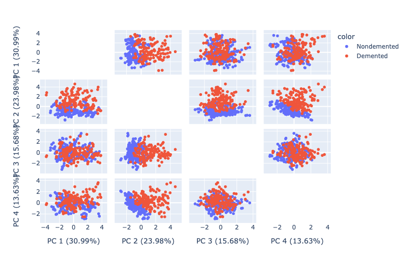

The following table shows the total percent of Explained Variance for the first n Principal Components.

| # of Principal Components  |1      |2      |3      |4      |5      |6      |7      |
| ---------------------------|-------|-------|-------|-------|-------|-------|-------|
| Total % Explained Variance |30.99  |54.97  |70.65  |84.28  |90.03  |93.79  |96.95  |

### Visualization
As mentioned earlier, the first component of the project involved preprocessing the dataset and exploring trends between the input features and dementia rates. Based on a demographic analysis, it was observed that dementia rates were greater among males, older individuals, as well as individuals with fewer years of education. Additionally, there were other physiological factors such as estimated total intracranial volume (eTIV) and normalized whole brain volume (nWBV) which showed further correlations with dementia rates. Specifically, higher values of eTIV were correlated with higher dementia rates; whereas, the opposite was true with regards to nWBV. Similarly, other input features such as education level, clinical dementia rating, socioeconomic status, and MMSE scores also exhibited varying degrees of correlation. 

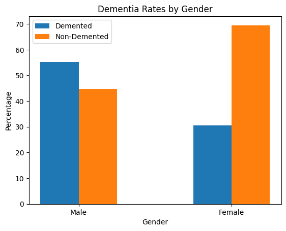
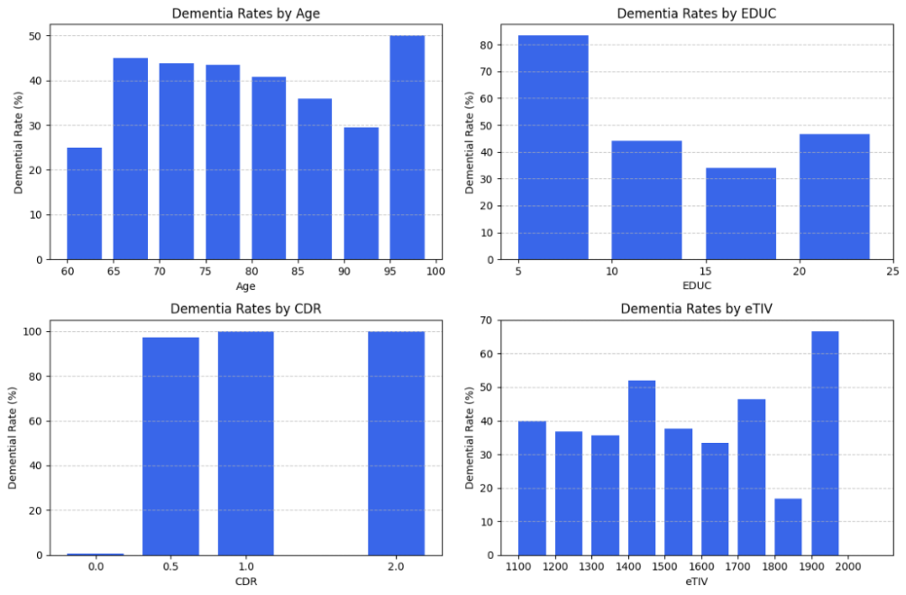

### SVM
We did initial testing of the SVM model parameters on the preprocessed data before implementing feature reduction. We found that different kernel types showed comparable efficacy in classification as highlighted by the SVC scores with RBF having slightly better performance.

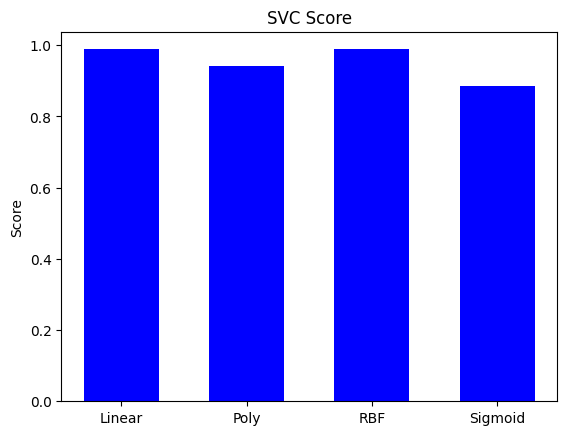

Similarly, we explored different values for both the SVM regularization and gamma parameters, it was noticed that a regularization value of ~0.25 produced the optimal SVC score with all other values resulting in uniformly distributed scores; whereas, in terms of the gamma parameter, it was observed that the higher the value, the lower the SVC score. 

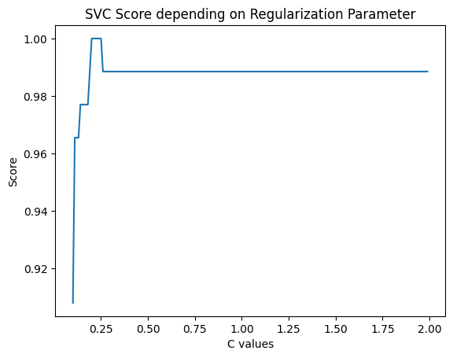
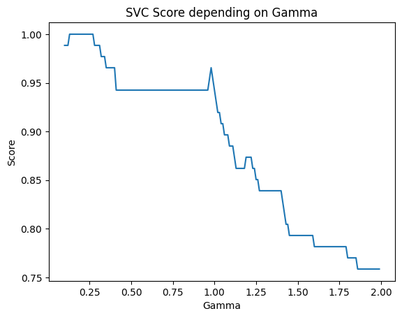

We used PCA to improve the accuracy of our SVM models. We again observed that the type of kernel had little effect on the performance of our SVM with RBF having slightly better accuracy. By reducing our dataset down to 2 features through PCA,  we were better able to better visualize the decision line of our SVC. Our classification accuracy with a 2 feature PCA was .80 which implies that our data may not be completely explainable using just 2 features. 

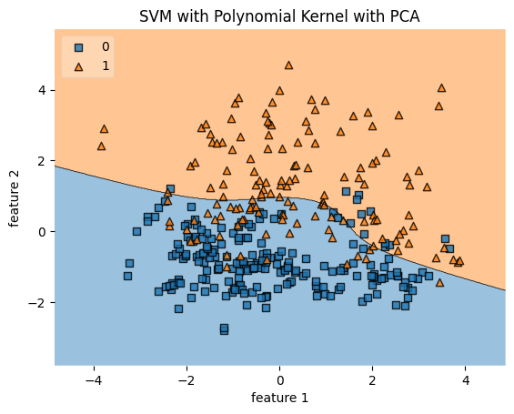
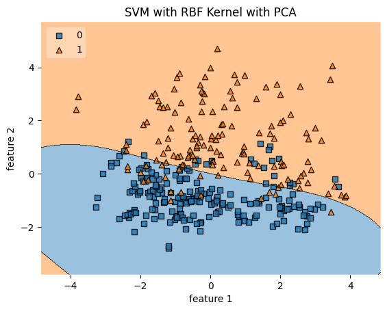

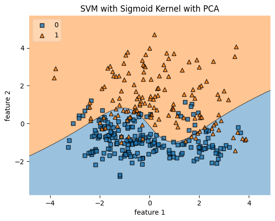
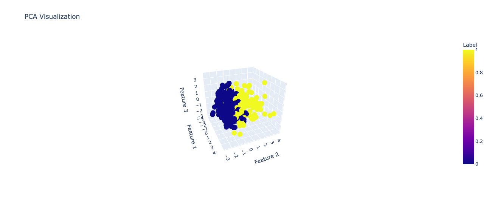

These are our observed scores for our SVC models using different numbers of principal components for PCA. We observed that our highest accuracy comes at 4 components and begins to level out once additional components are added.

|           |PCA 1  |PCA 2  |PCA 3  |PCA 4  |PCA 5  |
|-----------|-------|-------|-------|-------|-------|
|SVC Score  |.505   |.80    |.816   |.988   |.977   |
|F1 Score   |0.0    |.78    |.799   |.987   |.971   |

Our best model for SVM uses 4 principal components as input after PCA feature reduction and uses an RBF kernel. Additionally, we performed a grid search for hyper-parameter tuning of C and gamma. We found that the best values for C and gamma were 1.0 and .1 respectively. 

These are the final results of our SVM model with 4 principal components, RBF kernel,  C=1, and gamma = .1. Notice that we achieved a 98% accuracy which  is similar to the results from our ANN model.

|               |precision  |recall |f1-score   |support    |
|---------------|-----------|-------|-----------|-----------|
|0              |1.00       |.96    |.98        |54         |
|1              |.94        |1.00   |.97        |33         |
|accuracy       |           |       |.98        |87         |
|Macro avg      |.97        |.98    |.98        |87         |
|Weighted avg   |.98        |.98    |.98        |87         |

### ANN
Subsequently, when training the ANN model with the principal components, the accuracy of the trained Artificial Neural Network (ANN) model was 0.986. 

The scatter plot for Plotting **Predictions vs. True Values** below shows the relationship between the actual values (on the x-axis) and the predicted values (on the y-axis) for our model's performance on the test set. points along the diagonal line indicate perfect predictions. The less scattered the points are, the more accurate the predictions. Based on the plot, there is a clear positive correlation between the predicted and actual values, indicating that the model has learned to some extent the underlying relationship in the data. Most of the points are clustered around the diagonal, which suggests that our ANN model's predictions are reasonably accurate. 

Moreover, for the lower range of actual values, our ANN model predicts quite closely, as indicated by the density of points near the origin that closely follow the diagonal line. However, there is three variance from the line, especially in higher values of the actual group, which can be fixed by feeding more data to our ANN model.

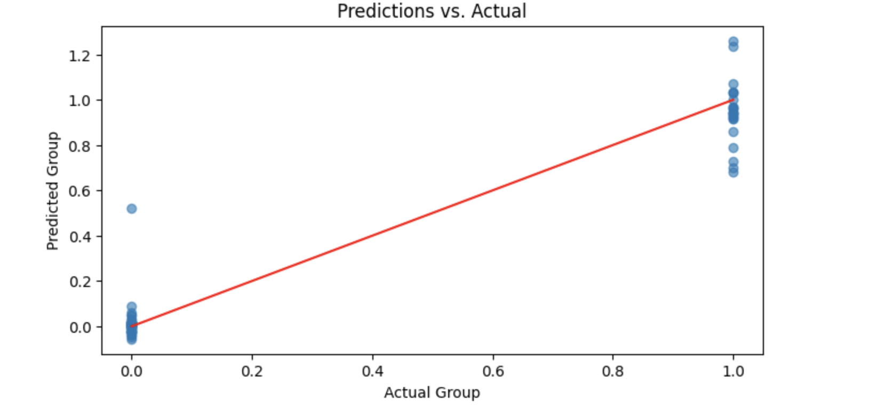

The plot below shows the Mean Absolute Error (MAE) for both the training and validation datasets in 100 epochs of training. The MAE is a measure of how close the model's predictions are to the actual values, with lower values indicating better performance. As the epochs continue, the training MAE shows a steady decline and begins to plateau, suggesting that the model is approaching the best performance it can achieve with the given data. The training MAE settles at a low value, which is a good sign of the model's ability to fit the training data. At the end of the training, both MAEs are quite low and stable, with a small gap between them. This stability and small gap are indicative of a well-trained model that has good predictive performance and generalizes well to unseen data.

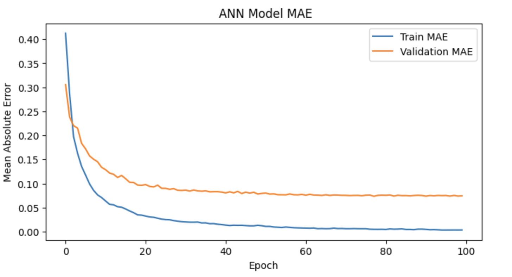

### Additional MRI Image Analysis using SVM

We wanted to explore how detection models would perform on raw MRI image data. We used the raw images from [kaggle](https://www.kaggle.com/datasets/ninadaithal/imagesoasis/data). We used the classes of Non-Demented, Mild Dementia, and Moderate Dementia with 488, 1000, 1000 images respectively. 

We wanted to Explore how SVM would perform in classifiying image data. Each image had the dimensions of (248, 496, 3) and we needed to extract important features so that it could be run in our SVM classifier. To extract features we used Histogram of Oriented Gradients (HOG) which typically used for object detection. It is helpful here for the shapes and sizes of regions of the brain which may be atrophied. HOG had an output of 114,750 features for each image.

This is an exmaple of what the HOG output looks like from a MRI brain scan.

To reduce the number of features for our SVM model, we used PCA. We reduced the number of features down to 500, which allowed SVM to run in a reasonable amount of time. We then used a 70/30 test-train split before running our SVM model. We found that we had a 97.59% accuracy. 

However, we think that the model may be fitting to undesired features. For example, since some of the MRI images are just different slices of the same brain, the model may be simply classifying it by person instead of by atrophy of brain matter. Additional testing would be required for a more conslusive and genralizable result.  

### Model Comparison
As you can see, we achieved relatively high accuracies with both the SVM and the ANN models. Although we performed Principal Component Analysis before training both models, one thing to note is that we used a different number of components for each model. We retained all 9 features before training the ANN model, whereas we used 4 principal components for our best performing SVM model.

### Conclusion 
In this project, we applied machine learning techniques to the OASIS longitudinal dataset to explore the potential for early detection of Alzheimer's Disease (AD) through demographic, cognitive. Our analysis confirmed that certain factors such as gender, age, education level have significant correlations with the presence of dementia.

We use dimensionality reduction via PCA to our data, allowing us to maintain essential information while making our models computationally efficient. This was evident in the improved performance of our classification models post-PCA. The SVM model with an RBF kernel, after PCA reduction to four principal components and hyperparameter tuning through a grid search, achieved an impressive 98% accuracy, indicating a robust predictive capability.

The ANN model demonstrated a similarly high accuracy of 98.6%, as indicated by the close clustering of prediction points around the diagonal in the Predictions vs. Actual values plot.   This model exhibited excellent performance, particularly for lower ranges of actual values, which is a promising sign for its use in early detection scenarios. The Mean Absolute Error plot for the ANN highlighted a low and stable error rate post-training, confirming the model's reliable predictive accuracy and generalization.

The results from both models show great promise in using machine learning for aiding in the early detection of AD. The high accuracy rates indicate that these models could be used as effective tools in clinical settings to predict the progression to AD from mild cognitive impairment, potentially aiding in earlier and more effective intervention strategies. 

Our study demonstrates the viability of using machine learning models to aid in the early detection of Alzheimer's Disease. By leveraging PCA for dimensionality reduction and optimizing SVM and ANN models, we have established a solid foundation for future research and potential clinical application in the battle against AD.

## References

> Kavitha, C., Mani, V., Srividhya, S. R., Khalaf, O. I., & Tavera Romero, C. A. (2022). Early-Stage Alzheimer's Disease Prediction Using Machine Learning Models. Frontiers in public health, 10, 853294. https://doi.org/10.3389/fpubh.2022.853294 
>
>M. Tanveer, B. Richhariya, R. U. Khan, A. H. Rashid, P. Khanna, M. Prasad, and C. T. Lin. 2020. Machine Learning Techniques for the Diagnosis of Alzheimer’s Disease: A Review. >ACM Trans. Multimedia Comput. Commun. Appl. 16, 1s, Article 30 (January 2020), 35 pages. https://doi.org/10.1145/3344998
>
>Ask the doctors - what is the cause of death in alzheimer’s disease? UCLA Health System. https://www.uclahealth.org/news/ask-the-doctors-what-is-the-cause-of-death-in-alzheimers-disease#:~:text=The%20result%20is%20that%20Alzheimer’s,death%20for%20all%20adults%20nationwide. 
>
>Adi - dementia statistics. Alzheimer’s Disease International (ADI). https://www.alzint.org/about/dementia-facts-figures/dementia-statistics/#:~:text=Dementia%20mainly%20affects%20older%20people,new%20case%20every%203.2%20seconds.

## Contribution Chart

| Work                           | Xisheng Zhang | Harry Graney Green | Haidyn Arnett | Felix Wang | Prathik Senthil |
| -----------------------        | -----------   | ------------------ | ------------- | ---------- | --------------- |
| Conclusion                     | X             |                    |               |            |                 |
| Model Comparison               |               |                    |               | X          |                 |
| Video Recording                |               |                    | X             |            | X               |
| Image Data Exploration         |               | X                  |               |            |                 |
| Github Pages                   | X             | X                  | X             | X          | X               |
| Slides                         | X             | X                  | X             | X          | X               |

### Timeline

|TASK TITLE | TASK OWNER    |START DATE	    |DUE DATE   |DURATION   |
| ---------	| ------------- | ------------- | --------- | --------- |
|**Project Proposal** | | | | |
|Introduction & Background      |Felix  |9/29/23    | 10/6/23   | 8
|Problem Definition	            |Prathik|9/29/23	|10/6/23	|8
|Methods	                    |Harry	|9/29/23	|10/6/23	|8
|Potential Results & Discussion	|Xisheng|9/29/23	|10/6/23	|8
|Video Recording	            |Haidyn	|9/29/23	|10/6/23	|8
|GitHub Page	                |Haidyn	|9/29/23	|10/6/23	|8
|**Midterm Report**	| | | | |	
|Data Cleaning/Preprocessing    	|Haidyn	    |11/1/23	    |11/10/23	|10
|Data Visualization	                |Felix	    |11/1/23	|11/10/23	|10
|Support Vector Model (SVM) Design	|Harry	    |11/1/23	|11/10/23	|10
|Artificial Neural Network Design	|Xisheng	|11/1/23	|11/10/23	|10
|Results Evaluation and Analysis	|Prathik	|11/1/23	|11/10/23	|10
|Midterm Report	                    |All	    |11/1/23	|11/10/23	|10
|**Final Report**|||||
|Conclusion	|Xisheng	|11/27/23	|12/5/23	|9
|Model Comparison	|Felix	|11/27/23	|12/5/23	|9
|Image Data Exploration	|Harry	|11/27/23	|12/5/23	|9
|Video Recording	|Haidyn	|11/27/23	|12/5/23	|9
|Video Editing	|Prathik	|11/27/23	|12/5/23	|9
|GH Pages and Slides	|All	|11/27/23	|12/5/23	|9

